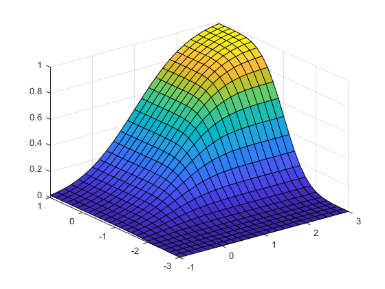
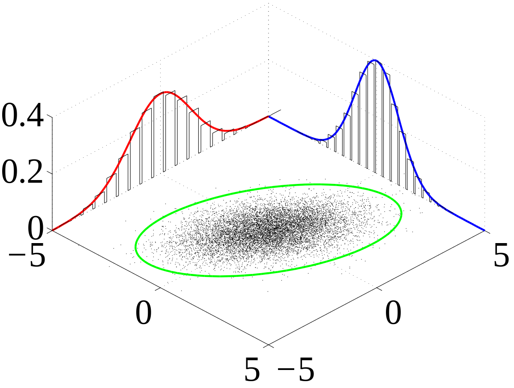
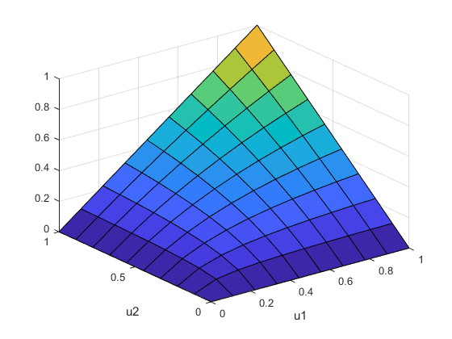

```{r setup, include=FALSE}
knitr::opts_chunk$set(echo = TRUE)
library(qad)
```

# Introduction

## Fundamental Definitions
For a random variable $X$, its cumulative distribution function (CDF) is given by:

$F_X(x)=P(X\leq x)$

## Fundamental Definitions
<!-- CDF-plot of a normal distributed random variable. -->
```{r,echo=TRUE, fig.height= 4}
x = seq(-1,1,length=1000)
y = pnorm(x,0,0.2)
plot(x, y, type="l", ylab='F(x)')
```

## Fundamental Definitions
For a pair of random variables $X,Y$ their joint cumulative distribution function is given by:

$F_{X,Y}(x,y)=P(X\leq x, Y\leq y)$
<center>
  { width=60% }
</center>

^[1]https://www.mathworks.com

## Fundamental Definitions
For a pair of continous random variables $X,Y$ with a known joint distribution, the marginal probability density function $p_X$ can be defined as:

$p_X(x)=\int_yp_{X,Y}(x,y)dy$ 

<center>
  { width=50% }
</center>

^[1]https://upload.wikimedia.org

## What is a Copula?
A simple (implicit) definition of a (bivariate) copula is as follows:
<!-- TODO: Should this implicit def stay? -->
A copula is the joint distribution of two -- on $[0,1]$ -- continous random variables, restricted to $[0,1]^2$

This implies the following two properties, which are also used to define two-dimensional Copulae explicitly:

A copula is a function $A:[0,1]^2 \to [0,1]$ with the following properties:

1. $\forall u \in [0,1]: A(u,1) = A(1,u) = u, A(u,0) = A(0,u) = 0$

2. For  $0 \leq u_1 \leq u_2 \leq 1$ and $0 \leq v_1 \leq v_2 \leq 1$ we have:
    $A(u_2,v_2) - A(u_1,v_2) - A(u_2,v_1) + A(u_1,v_1) \geq 0$

## Examples of Copulae
* $M(u,v) = \text{min}\{u,v\}$
* $W(u,v) = \text{max}\{u+v-1,0\}$
* $\Pi(u,v) = u \cdot v$   (product copula)

Recall: For independent random variables, the joint distribution is the product of the marginal distributions.

<center>
  { width=40% }
</center>

^[1]https://www.mathworks.com

## The Sklar theorem:
Let $H$ denote the joint distribution of the random variables $X,Y$. Furhermore, let $X \sim F$ and $Y \sim G$. Then, there exists a copula $A$, such that for all $x,y \in \mathbb{R}$ we have:
$$ H(x,y) = A(F(x),G(y)) $$
For continuous $F,G$, the Copula $A$ is unique.
On the other hand, for every copula $A$, we get a two-dimensional distribution via $A(F,G)$.

So, (two-dimensional) copulae give us the link between two-dimensional distributions and their marginal distributions.


## Empirical Distribution Function
Given a sample $S$ of size $n$ of a random variable $X$, how would we estimate the underlying distribution of $X$?


## Empirical Distribution Function
Given a sample $S$ of size $n$ of a random variable $X$, how would we estimate the underlying distribution of $X$?

The Empirical Distribution Function is defined as:
$$\hat F_n(x) = \frac{\#\{x_i\in S|x_i\leq x\}}{n}$$

In R, this function can be calculated via the call *ecdf(sample)*
<!-- In R this can be calculated with the function ecdf(x).  -->

## Exercise 0 - Empirical distribution function
<!-- TODO optional -->

## Empirical Copula
We can try a similar approach with copulae, since the Sklar theorem at least gives us the existence of a copula $A_n$, i.e. 
$H_n(x,y) = A_n(F_n(x),G_n(y))$.
<!-- So given a sample $S$ of two random variables $X$ and $Y$, we define the Empirical copula as follows: -->
<!-- $$ \hat C_n(\frac{i}{n},\frac{j}{n}) =  \frac{\#\{(x,y)\in S|\}}{}$$ -->

However, depending on the metric used, we will not get convergence just like that. 
<!-- convergence in what space, what metric? -->
<!-- TODO: should be clearer explained-->

## Empirical Copula -- Example

```{r, echo=FALSE, message = FALSE, fig.height=3}
set.seed(2019)
x = rnorm(8)
y = runif(8)
require(gridExtra)
p1 = qplot(x,y) + theme_bw() + theme(aspect.ratio = 1)
p2 = qplot(ecdf(x)(x),ecdf(y)(y)) + theme_bw() + theme(aspect.ratio = 1) + xlim(0,1) + ylim(0,1)
grid.arrange(p1,p2,ncol=2)
```

We now take any copula $B$ and shrink it down by $\frac{1}{n}$ -- now it has the size of a single square of the grid. Then we put this shrunk $B$ for each grid square with a pseudo--observation for its upper right corner.
<!-- TODO: this section should be explained clearer -->

## Empirical Copula -- Example

```{r, fig.height=3.5, echo = FALSE}
emp_cop = emp_c_copula(data.frame(x,y), smoothing=FALSE)
plot_density(emp_cop, density = FALSE)+ theme_bw() + theme(aspect.ratio = 1) + xlim(0,1) + ylim(0,1) +
  geom_point(data = data.frame(x=ecdf(x)(x), y=ecdf(y)(y)), aes(x=x,y=y))
```

This is, how an empirical copula may look like, if we constructed it using the product copula $\Pi$.


## Checkerbord Copulae:
We would like to have convergence even in the mysterious $D_1$ metric. 
<!-- TODO: Definition auf welchem Raum D_1 definiert ist plus was es ca. macht. -->

One problem could be, that the sample size dictates, how many squares actually have mass and that mass is always the same, $\frac{1}{n}\text{mass of }B$ or $0$.

What we could try to do is decoupling the fineness of the grid from the sample size (ensuring, that we still end up with a copula).

An absolutely continous copula, which has a constant density on the interior of each square of our (refined) $N \times N$ grid, we call $N-$ Checkerboard Copula.
<!-- TODO: was ist damit gemeint? -->

## Example

```{r,echo=FALSE,warning=FALSE, fig.height=3.5}
cop = emp_c_copula(data.frame(x,y),smoothing = TRUE,resolution = 30)
plot_density(cop, density = FALSE) + theme(aspect.ratio = 1)
```

We started with the same (pseudo-) observations, but achieved smoother transitions between squares with mass / no mass.


## The Function emp_c_copula
<!-- TODO: No documentation ;explaination-->
The function emp_c_copula the mass-distribution of the empirical (checkerboard) copula, given a bivariate sample $(x_1,y_1),\dots,(x_n,y_n)$.

```{r, message=FALSE}
#install.packages("qad")
library(qad)
```
```{r}
n = 200
x = runif(n,0,1)
y = runif(n,0,1) 
df = data.frame(x,y)
emp_cop = emp_c_copula(df,smoothing = FALSE)
emp_check_cop = emp_c_copula(df,smoothing = TRUE,resolution = 20)
```

## The Function plot_density:
The function plot_density allows us to visualize copulae by plotting its density.
```{r,echo = FALSE, message=FALSE}
require(gridExtra)
```
```{r, echo=TRUE, eval=FALSE}
plot_density(emp_cop, density=TRUE)
plot_density(emp_check_cop, density=TRUE)
```
```{r, echo=FALSE}
p1 = plot_density(emp_cop, density=TRUE) + theme(aspect.ratio = 1) 
p2 = plot_density(emp_check_cop, density=TRUE) + theme(aspect.ratio = 1)
grid.arrange(p1,p2,ncol=2)
```


## Exercise 1 - Empirical copula

  * Compute the mass distribution of the empirical checkerboard copula
  
  * 

  *
  
  *
  
  *

# Dependence Measure $\zeta_1$

## Motivation

Copulae give us information of the dependency between two RVs $X$ and
$Y$. If they are independent, which means information about $X$ does not
give us any about $Y$ and vice versa, we already established, that the
product copula $\Pi$ describes exactly that.

On the other hand we could have complete dependence, i.e. knowing $X$ we
also know $Y$ and vice versa. Such a property should be reflected in the
Copula and we want to use this to construct a *dependence measure*.

## The $\zeta_1$-Measure

Based on a metric $D1$ such a dependency meassure for a copula A can be
constructed in the following way:
$$ \zeta_1(A) := 3\cdot D_1(A,\Pi) \; \in [0,1] $$
where $\Pi$ is the product copula and the mysterious $D_1$ is, as stated
before, a metric for copulae. Its construction involves markov kernels
and we can make due without discussing $D_1$ in detail.

Dependent copulae are "close" to $\Pi$ and have a low
$\zeta_1$-dependency measure, while independent copulae are "far" from
$\Pi$ and thus have a high dependency measure.

## what do we do with that?

Now, we have a sample $(x_1,y_1), \dots, (x_n, y_n)$ and we would like
to know "a" degree of dependency between the underlying RVs $X$ and $Y$.

We already know how to estimate the copula $A$, that describes the
distribution $F_{(X,Y)}$ and that is the empirical (checkerboard) copula.

We note again, that not any empirical copula will converge to the "true"
one in the $D_1$ metric, but the empirical checkerboard does converge.

## what do we do with that?

So, we calculate the empirical checkerboard copula $A_n$, which is a
good estimate for $A$. Then we simply estimate the dependency between
$X$ and $Y$ as $\zeta_1(A_n)$

It would be a bit of work to do all that by hand. Luckily there is a
R-function that will spare us the hassle. 

## The qad object:
A qad object can be generated with with: 
```{r, eval=FALSE}
qad(x)
```
where x is a dataframe containing the observations of two univariate/one bivariate sample.

Interesting for us is the qad component *results*, which carries the results of the $\zeta_1$ dependency meassure.

## The qad object:
Example:
```{r, eval=TRUE}
n = 100
x = runif(n,-1,1)
y = abs(x)
df = data.frame(x,y)
mod = qad(df, print = FALSE, permutation = TRUE, resolution = 15)
mod$results
```

## Ecercise 2 - qad
  
  * Download the RTR-dataset 
  
    (via load(url("http://www.trutschnig.net/RTR.RData")) )
  
    and sample 1000 observations
  
  * Examine which columns could have interesting dependencies
  
  * Create a qad object using the qad() method on the found columns
  
  * Use summary.qad() to get a closer look at the object
  
# Methods for qad  
  
## Plot.qad
Plotting a qad objects visualizes the estimated conditional probabilities for our random variables.

That means: for each strip in the plot we can determine the probability of the dependent variable given the strip in which the conditional variable lies.

We generate a qad object with low resolution and look at the plot:
```{r}
x = runif(n,-1,1)
y = abs(x)
df = data.frame(x,y)
mod = qad(df, print = FALSE, permutation = TRUE, resolution = 6)
```  
## Plot.qad
```{r}
plot(mod, addSample = TRUE)
```

## predict.qad
```{r}
predict(mod, values=c(0), conditioned = "x1")
```
Here, we calculate the probability that for $(x_1,x_2)\sim(X,Y)$, $x_2$ lies in one of the intervalls above, 
given that $x_1$ lies in the strip that contains $x1=0$.  

## Exercise 3 - plot

  * Create a dummy dataset: n=100 observations of a uniformly distributed random variable and the corresponding square values.
  
  * Create a new qad object and use the plot function to visualize the copula.
  
  * Add the observations to the plot with the addSample parameter.
  
  * What does the copula parameter change in the output?
  
## pairwise.qad
Now we have more than 2 RVs and are interested in their dependecies:  
```{r,echo=FALSE, results="hide"}
n = 100
x = runif(n,-1,1)
y = x^3-x 
z = runif(n,-1,1)
df = data.frame(x,y,z)
mod = pairwise.qad(df, permutation = TRUE)
```  
```{r,eval=FALSE}
n = 100
x = runif(n,-1,1)
y = x^3-x 
z = runif(n,-1,1)
df = data.frame(x,y,z)
mod = pairwise.qad(df, permutation = TRUE)
mod$q
```  
```{r,echo=FALSE}
mod$q
```

## heatmap.qad
We can visualize the pairwise dependencies with a heatmap:
```{r, fig.height = 3}
heatmap.qad(mod, select = "dependence", 
                 significance = TRUE, 
                 sign.level = 0.01)
```  


## Exercise 4 - 

<!-- TODO Exercise with pairwise and heatmap  -->
  


  
  
## The End


<center>
Thank you for your attention!
</center>
